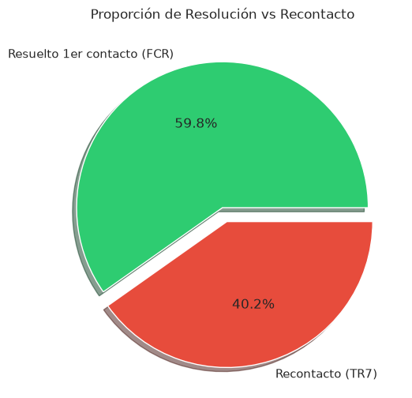
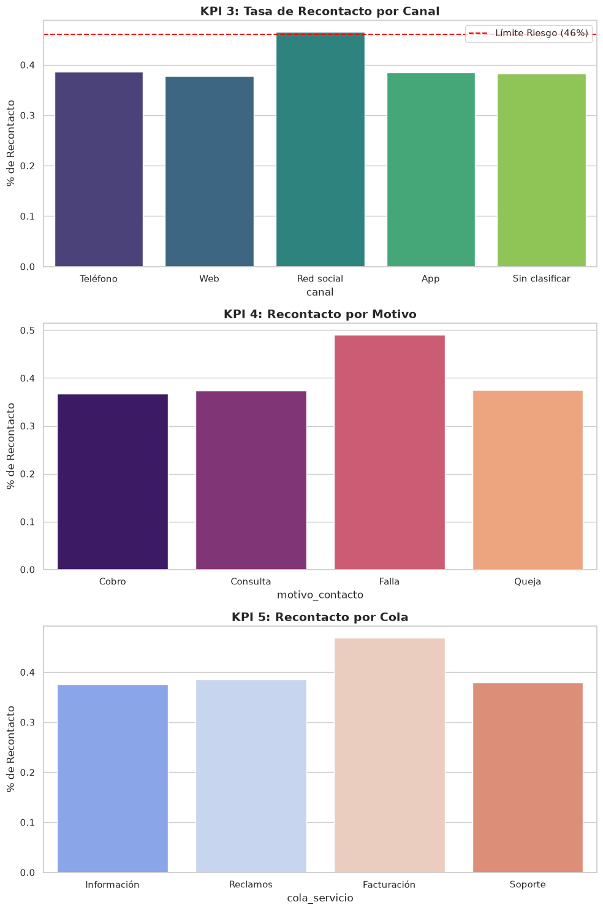

# EDA y KPIs - Servicio Ciudadano 1800 (Caso 15)
Este cuaderno fue adaptado para cargar la vista limpia y responder a las preguntas de negocio (KPIs).


```python
import os
import pyodbc
import pandas as pd
import matplotlib.pyplot as plt
import seaborn as sns

sns.set_theme(style="whitegrid")
plt.rcParams['figure.figsize'] = (10, 6)

# Conexión directa a SQL Server (contenedor db)
server = os.getenv('DB_SERVER', 'db')
database = os.getenv('DB_NAME', 'ServicioCiudadanoDW')
username = os.getenv('DB_USER', 'SA')
password = os.getenv('DB_PASSWORD', 'J0AhMXX4H0QBrRr8R1U098y8aA1@')
driver = os.getenv('DB_DRIVER', '{ODBC Driver 18 for SQL Server}')

connection_string = f'DRIVER={driver};SERVER={server};DATABASE={database};UID={username};PWD={password};TrustServerCertificate=yes;'

print("🔄 Conectando a SQL Server y cargando datos...")
conn = pyodbc.connect(connection_string)
df = pd.read_sql("SELECT * FROM vw_v1_limpio", conn)
conn.close()

print(f"✅ Datos cargados: {df.shape[0]} filas limpias, {df.shape[1]} columnas")
df.head()

```

    🔄 Conectando a SQL Server y cargando datos...


    /tmp/ipykernel_35/328054759.py:21: UserWarning: pandas only supports SQLAlchemy connectable (engine/connection) or database string URI or sqlite3 DBAPI2 connection. Other DBAPI2 objects are not tested. Please consider using SQLAlchemy.
      df = pd.read_sql("SELECT * FROM vw_v1_limpio", conn)


    ✅ Datos cargados: 73923 filas limpias, 14 columnas


<div>
<style scoped>
    .dataframe tbody tr th:only-of-type {
        vertical-align: middle;
    }

    .dataframe tbody tr th {
        vertical-align: top;
    }

    .dataframe thead th {
        text-align: right;
    }
</style>
<table border="1" class="dataframe">
  <thead>
    <tr style="text-align: right;">
      <th></th>
      <th>id_interaccion</th>
      <th>fecha_contacto</th>
      <th>fecha_carga</th>
      <th>canal</th>
      <th>motivo_contacto</th>
      <th>cola_servicio</th>
      <th>duracion_seg</th>
      <th>espera_seg</th>
      <th>grabacion_autorizada</th>
      <th>recontacto_7_dias</th>
      <th>casos_previos_30d</th>
      <th>nivel_transferencias</th>
      <th>tipo_usuario</th>
      <th>turno</th>
    </tr>
  </thead>
  <tbody>
    <tr>
      <th>0</th>
      <td>00068ef7-e2ec-48bb-8cb1-270419504731</td>
      <td>2025-12-07 02:20:17.803</td>
      <td>2026-10-08 00:20:17.803</td>
      <td>Teléfono</td>
      <td>Cobro</td>
      <td>Información</td>
      <td>1717</td>
      <td>796</td>
      <td>No</td>
      <td>0</td>
      <td>4</td>
      <td>1</td>
      <td>Particular</td>
      <td>Nocturno</td>
    </tr>
    <tr>
      <th>1</th>
      <td>000b0a9b-4ed0-43be-9b45-f49c809a5807</td>
      <td>2025-12-12 12:24:23.487</td>
      <td>2026-10-08 00:24:23.483</td>
      <td>Web</td>
      <td>Consulta</td>
      <td>Reclamos</td>
      <td>1542</td>
      <td>523</td>
      <td>Sí</td>
      <td>0</td>
      <td>2</td>
      <td>1</td>
      <td>Gobierno</td>
      <td>AM</td>
    </tr>
    <tr>
      <th>2</th>
      <td>000b22a5-5962-4935-8f48-a91dcc1403c6</td>
      <td>2026-05-25 14:18:51.413</td>
      <td>2026-10-08 00:18:51.410</td>
      <td>Red social</td>
      <td>Consulta</td>
      <td>Información</td>
      <td>728</td>
      <td>392</td>
      <td>Sí</td>
      <td>0</td>
      <td>0</td>
      <td>0</td>
      <td>Empresa</td>
      <td>PM</td>
    </tr>
    <tr>
      <th>3</th>
      <td>000be391-b24f-47ee-a19c-4e6a11790eb0</td>
      <td>2026-01-14 09:14:53.353</td>
      <td>2026-10-08 00:14:53.350</td>
      <td>App</td>
      <td>Consulta</td>
      <td>Facturación</td>
      <td>1177</td>
      <td>896</td>
      <td>No</td>
      <td>1</td>
      <td>4</td>
      <td>0</td>
      <td>Particular</td>
      <td>AM</td>
    </tr>
    <tr>
      <th>4</th>
      <td>000f65d2-da1d-46ad-b6f3-ddb412796923</td>
      <td>2026-02-06 19:19:24.777</td>
      <td>2026-10-08 00:19:24.773</td>
      <td>Red social</td>
      <td>Falla</td>
      <td>Facturación</td>
      <td>191</td>
      <td>53</td>
      <td>Sí</td>
      <td>0</td>
      <td>0</td>
      <td>1</td>
      <td>Empresa</td>
      <td>PM</td>
    </tr>
  </tbody>
</table>
</div>


```python
# Celda 2: KPI 1 & 2 - Tasa de Recontacto (TR7) y FCR Estimado
# El recontacto es nuestra variable objetivo principal
tr7 = df['recontacto_7_dias'].mean() * 100
fcr = 100 - tr7

print("=" * 60)
print(f"🎯 KPI 1: Tasa de Recontacto a 7 días (TR7)")
print(f"   Valor Actual: {tr7:.2f}% (Meta del negocio: <= 22%)")
print("-" * 60)
print(f"🏆 KPI 2: FCR Estimado (First Contact Resolution)")
print(f"   Valor Actual: {fcr:.2f}% (Benchmark sector: >= 78%)")
print("=" * 60)

# Gráfico de pastel
plt.figure(figsize=(6,6))
plt.pie([fcr, tr7], labels=['Resuelto 1er contacto (FCR)', 'Recontacto (TR7)'], 
        autopct='%1.1f%%', colors=['#2ecc71', '#e74c3c'], explode=(0, 0.1), shadow=True)
plt.title('Proporción de Resolución vs Recontacto')
plt.show()

```

    ============================================================
    🎯 KPI 1: Tasa de Recontacto a 7 días (TR7)
       Valor Actual: 40.21% (Meta del negocio: <= 22%)
    ------------------------------------------------------------
    🏆 KPI 2: FCR Estimado (First Contact Resolution)
       Valor Actual: 59.79% (Benchmark sector: >= 78%)
    ============================================================


    

    


```python
# Celda 3: KPI 3, 4 y 5 - Riesgo de Recontacto por Dimensiones
fig, axes = plt.subplots(3, 1, figsize=(10, 15))

# Por Canal
sns.barplot(data=df, x='canal', y='recontacto_7_dias', ax=axes[0], palette='viridis', errorbar=None)
axes[0].set_title('KPI 3: Tasa de Recontacto por Canal', fontsize=14, fontweight='bold')
axes[0].set_ylabel('% de Recontacto')
axes[0].axhline(0.46, color='red', linestyle='--', label='Límite Riesgo (46%)')
axes[0].legend()

# Por Motivo
sns.barplot(data=df, x='motivo_contacto', y='recontacto_7_dias', ax=axes[1], palette='magma', errorbar=None)
axes[1].set_title('KPI 4: Recontacto por Motivo', fontsize=14, fontweight='bold')
axes[1].set_ylabel('% de Recontacto')

# Por Cola
sns.barplot(data=df, x='cola_servicio', y='recontacto_7_dias', ax=axes[2], palette='coolwarm', errorbar=None)
axes[2].set_title('KPI 5: Recontacto por Cola', fontsize=14, fontweight='bold')
axes[2].set_ylabel('% de Recontacto')

plt.tight_layout()
plt.show()

```

    /tmp/ipykernel_35/3166778481.py:5: FutureWarning: 
    
    Passing `palette` without assigning `hue` is deprecated and will be removed in v0.14.0. Assign the `x` variable to `hue` and set `legend=False` for the same effect.
    
      sns.barplot(data=df, x='canal', y='recontacto_7_dias', ax=axes[0], palette='viridis', errorbar=None)


    /tmp/ipykernel_35/3166778481.py:12: FutureWarning: 
    
    Passing `palette` without assigning `hue` is deprecated and will be removed in v0.14.0. Assign the `x` variable to `hue` and set `legend=False` for the same effect.
    
      sns.barplot(data=df, x='motivo_contacto', y='recontacto_7_dias', ax=axes[1], palette='magma', errorbar=None)


    /tmp/ipykernel_35/3166778481.py:17: FutureWarning: 
    
    Passing `palette` without assigning `hue` is deprecated and will be removed in v0.14.0. Assign the `x` variable to `hue` and set `legend=False` for the same effect.
    
      sns.barplot(data=df, x='cola_servicio', y='recontacto_7_dias', ax=axes[2], palette='coolwarm', errorbar=None)


    

    


```python

```
