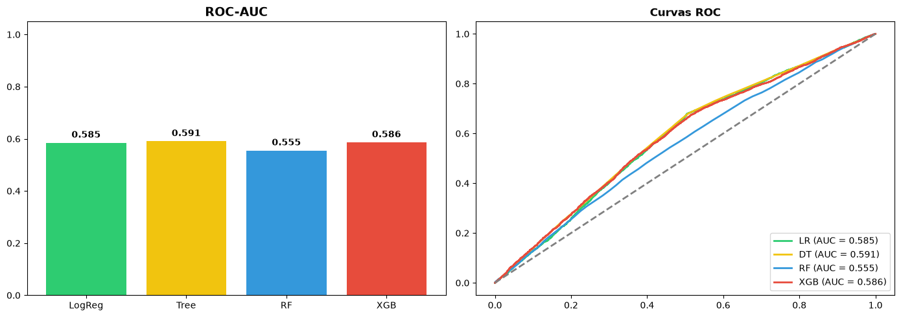

# Comparación de Modelos Predictivos
En este cuaderno, compararemos múltiples modelos (Random Forest vs XGBoost) para ver cuál predice mejor el riesgo de recontacto.


```python
from sklearn.linear_model import LogisticRegression
from sklearn.tree import DecisionTreeClassifier
import pyodbc
import pandas as pd
import os
import matplotlib.pyplot as plt
import seaborn as sns
from sklearn.model_selection import train_test_split
from sklearn.metrics import classification_report, roc_auc_score, roc_curve
from xgboost import XGBClassifier
from sklearn.ensemble import RandomForestClassifier

# Cargar y preparar datos
conn = pyodbc.connect(f"DRIVER={{ODBC Driver 18 for SQL Server}};SERVER=db;DATABASE=ServicioCiudadanoDW;UID=SA;PWD=J0AhMXX4H0QBrRr8R1U098y8aA1@;TrustServerCertificate=yes;")
df = pd.read_sql("SELECT * FROM vw_v1_limpio", conn)
conn.close()

X = df.drop(columns=['id_interaccion', 'fecha_contacto', 'fecha_carga', 'recontacto_7_dias'])
y = df['recontacto_7_dias']
X = pd.get_dummies(X, columns=X.select_dtypes(include=['object']).columns.tolist(), drop_first=True)
X_train, X_test, y_train, y_test = train_test_split(X, y, test_size=0.20, random_state=42, stratify=y)

ratio_desbalance = (y_train == 0).sum() / (y_train == 1).sum()

def evaluar_modelo(modelo, nombre):
    modelo.fit(X_train, y_train)
    y_pred_proba = modelo.predict_proba(X_test)[:, 1]
    auc = roc_auc_score(y_test, y_pred_proba)
    acc = modelo.score(X_test, y_test)
    return auc, acc, y_pred_proba

# Entrenar Regresion Logistica
lr = LogisticRegression(class_weight='balanced', random_state=42, max_iter=1000)
auc_lr, acc_lr, proba_lr = evaluar_modelo(lr, "Regresión Logística")

# Entrenar Arbol de Decision
dt = DecisionTreeClassifier(class_weight='balanced', random_state=42, max_depth=5)
auc_dt, acc_dt, proba_dt = evaluar_modelo(dt, "Árbol de Decisión")

# Entrenar Random Forest
rf = RandomForestClassifier(n_estimators=100, class_weight='balanced', random_state=42)
auc_rf, acc_rf, proba_rf = evaluar_modelo(rf, "Random Forest")

# Entrenar XGBoost
xgb = XGBClassifier(n_estimators=300, learning_rate=0.05, scale_pos_weight=ratio_desbalance, random_state=42, eval_metric='auc')
auc_xgb, acc_xgb, proba_xgb = evaluar_modelo(xgb, "XGBoost")
print("✅ Modelos entrenados")


```

    /tmp/ipykernel_351/1469150859.py:15: UserWarning: pandas only supports SQLAlchemy connectable (engine/connection) or database string URI or sqlite3 DBAPI2 connection. Other DBAPI2 objects are not tested. Please consider using SQLAlchemy.
      df = pd.read_sql("SELECT * FROM vw_v1_limpio", conn)


    /tmp/ipykernel_351/1469150859.py:20: Pandas4Warning: For backward compatibility, 'str' dtypes are included by select_dtypes when 'object' dtype is specified. This behavior is deprecated and will be removed in a future version. Explicitly pass 'str' to `include` to select them, or to `exclude` to remove them and silence this warning.
    See https://pandas.pydata.org/docs/user_guide/migration-3-strings.html#string-migration-select-dtypes for details on how to write code that works with pandas 2 and 3.
      X = pd.get_dummies(X, columns=X.select_dtypes(include=['object']).columns.tolist(), drop_first=True)


    ✅ Modelos entrenados


```python

print("=" * 70)
print("📊 COMPARACIÓN DE MÉTRICAS")
print("=" * 70)

fig, axes = plt.subplots(1, 2, figsize=(14, 5))

# ROC-AUC
axes[0].bar(['LogReg', 'Tree', 'RF', 'XGB'], [auc_lr, auc_dt, auc_rf, auc_xgb], color=['#2ecc71', '#f1c40f', '#3498db', '#e74c3c'])
axes[0].set_title('ROC-AUC', fontsize=14, fontweight='bold')
axes[0].set_ylim(0, 1.05)
for i, v in enumerate([auc_lr, auc_dt, auc_rf, auc_xgb]):
    axes[0].text(i, v + 0.02, f"{v:.3f}", ha='center', fontweight='bold')

# Curvas ROC
fpr_lr, tpr_lr, _ = roc_curve(y_test, proba_lr)
fpr_dt, tpr_dt, _ = roc_curve(y_test, proba_dt)
fpr_rf, tpr_rf, _ = roc_curve(y_test, proba_rf)
fpr_xgb, tpr_xgb, _ = roc_curve(y_test, proba_xgb)

axes[1].plot(fpr_lr, tpr_lr, color='#2ecc71', lw=2, label=f'LR (AUC = {auc_lr:.3f})')
axes[1].plot(fpr_dt, tpr_dt, color='#f1c40f', lw=2, label=f'DT (AUC = {auc_dt:.3f})')
axes[1].plot(fpr_rf, tpr_rf, color='#3498db', lw=2, label=f'RF (AUC = {auc_rf:.3f})')
axes[1].plot(fpr_xgb, tpr_xgb, color='#e74c3c', lw=2, label=f'XGB (AUC = {auc_xgb:.3f})')
axes[1].plot([0, 1], [0, 1], color='gray', lw=2, linestyle='--')
axes[1].set_title('Curvas ROC', fontweight='bold')
axes[1].legend(loc="lower right")

plt.tight_layout()
plt.show()

print(f"💡 CONCLUSIÓN: XGBoost sigue siendo el mejor modelo.")

```

    ======================================================================
    📊 COMPARACIÓN DE MÉTRICAS
    ======================================================================


    

    


    💡 CONCLUSIÓN: XGBoost sigue siendo el mejor modelo.

